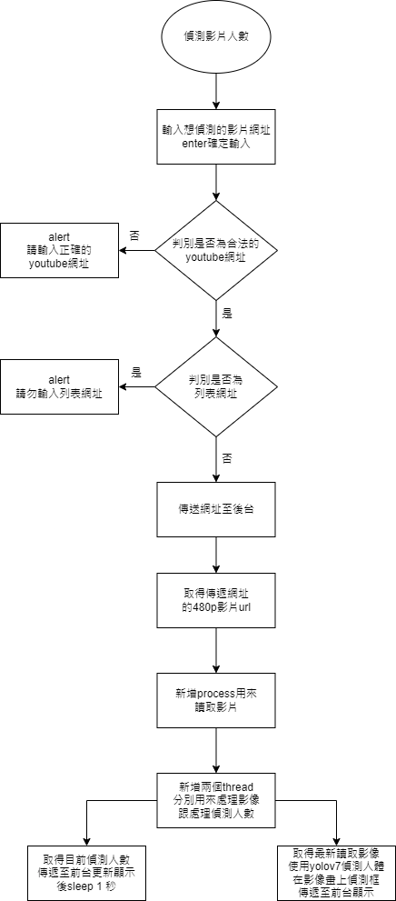

# Backend
目前這專案，是用來練習前後台撰寫。
用途是偵測影片中的人數
現在主要是偵測youtube上的即時影片串流

## How to run
目前版本為尚為開發版本，所以需要指令較多
待之後整合
docker build -t crowd_monitoring . --no-cache
bash run.sh
docker exec -it crowd_monitoring bash
cd tf
cd workspace
python main.py

## 目前可能問題
1.可能要注意電腦本身顯卡cuda版本是否符合torch所需驅動
2.mac環境下yolov7尚無法使用m1來加速，也無顯卡，使用上可能會有問題，需將yolo/CustomDetect.py 的CustomDetect 的
self.device修改為'cpu'

## 流程圖

### 取得傳遞網址的480p影片url
透過yt-dlp取得傳送過來的網址的480p影片的url
目前測試下480p的影片在讀取後傳送是順的，若是影片畫質再提高會有延遲的狀況
### 新增process用來讀取影片
因為cv2每次讀取影像都是讀取下一個frame，若是有延遲讀取，可能會延遲越拉約大，例如:每個frame延遲0.1秒，10個frame後延遲就可能拉到1秒了。

為了保證影片不會越來越延遲，所以使用multiprocessing來讀取影片

每次讀取frame保持最新一格frame即可，若還有其他frame尚未被送出顯示，就捨棄

注意的是cv2物件不能作為參數傳入multiprocess，而要有存取修改的參數需要使用multiprocessing.Manager().Queue來處理
### 新增兩個thread分別用來處理影像跟偵測人數
由於偵測人數更新不用像影像一樣每個frame都需要更新，所以切成兩個thread，一邊顯示影像，一邊每次sleep一秒再更新偵測人數。
### 取得最新讀取影像...
每次會取得當前最新影像，由於中間幾個frame掉了沒關係，但要盡量保持沒有延遲，所以每次會取最新的影像送入yolov7做偵測
### 取得目前偵測人數傳遞至前台...
不需要像影像每個frame都要送，每秒送一次即可

## 預計新增功能
1. 人數到達一定時，將當下的圖片以及人數透過telegram bot傳遞告知使用者
2. 將人流趨勢以圖片呈現
3. 新增其他影片來源

## Reference
https://github.com/WongKinYiu/yolov7
https://github.com/yt-dlp/yt-dlp/
https://www.kaggle.com/code/parapapapam/yolov7-quick-start
